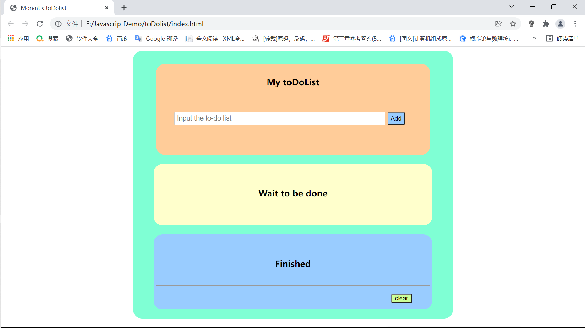
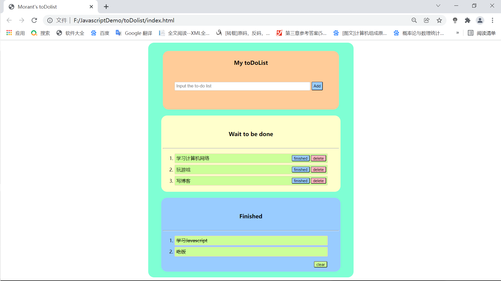

# toDoList_Demo
# todo_list Demo概述

​		This is a todo_list demo which Technology stack are HTML CSS Javascript and localStorage。

​		这次做的todoList Demo完全使用HTML、CSS、Javascript原生DOM完成。虽然是个简单的东西，但是在做的时候也遇到了很多逻辑上的东西以及一些技术问题。话不多说上才艺。

## 一、Demo预览

## 二、逻辑问题

1. 数据存储：使用localStorage实现本地存储，页面关闭上次使用仍然存在。将数据获取到之后存放到localStorage存储，然后再从localStorage中获取数据渲染。以localStorage为中介，任何数据存储以及显示都要以localStorage中的数据为准。
2. 添加待办：先将待办事项获取到然后存放到localStorage，之后删除页面上的DOM结点，再从localStorage中获取数据，生成结点渲染到页面上，解决li结点重复显示的问题
3. 持续数据：当每次关闭或者操作页面的时候都要先从localStorage中获取数据存放到全局变量对象数组中，防止页面刷新或者关闭之后localStorage中的数据被重置
4. 结点渲染函数load：在页面每次生成的时候执行load函数加载节点、渲染数据
5. **函数封装的思想** ：最大的体会就是每个函数做好自己的事，代码之间的逻辑通过函数的封装提高了程序的可读性，避免在程序流中出现过多高耦合的代码。
6. 数据存储：使用localStorage一对键值对，存储的时候存储的是字符串，在操作数据的时候将字符串转换为对象数组对数据进行访问。
7. 使用事件委托处理列表点击事件减少DOM操作稍微提高程序性能。
